# FEDORA
INTALACION PASO A PASO DE FEDORA

## INICIO 
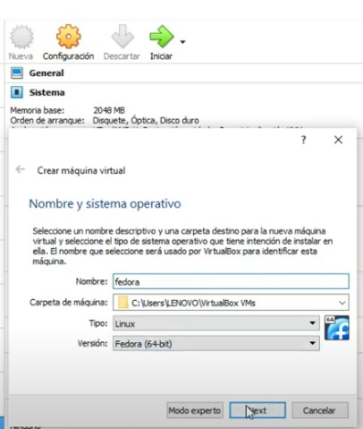

Desde la maquina virtualbox le damos nueva.. 
creamos nombre de nuestra maquina 
y selecionamos la version que tiene nuetro windows 
damos siguiente o next.

Le asignamos tamaño de memoria el que queramos o el recomendado por la maquina
y damos siguiente o next

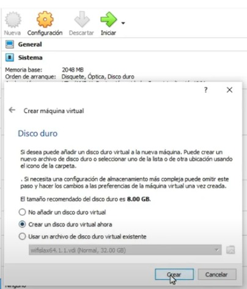

Le damos o selecionamos crear un disco duro virtual ahora.. Damos crear

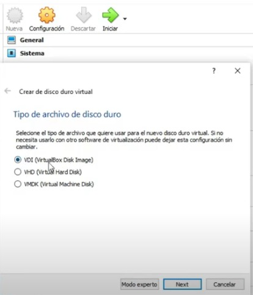

qq

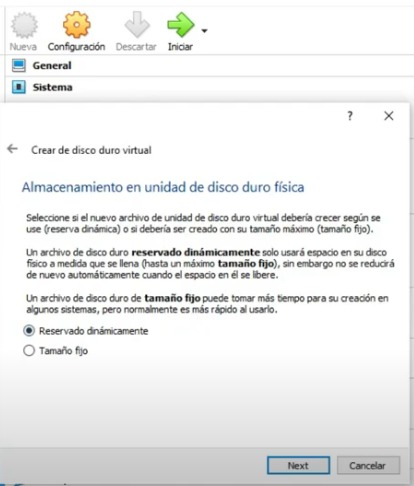

aaaa

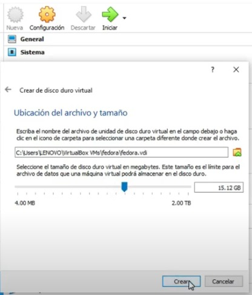

ssssss

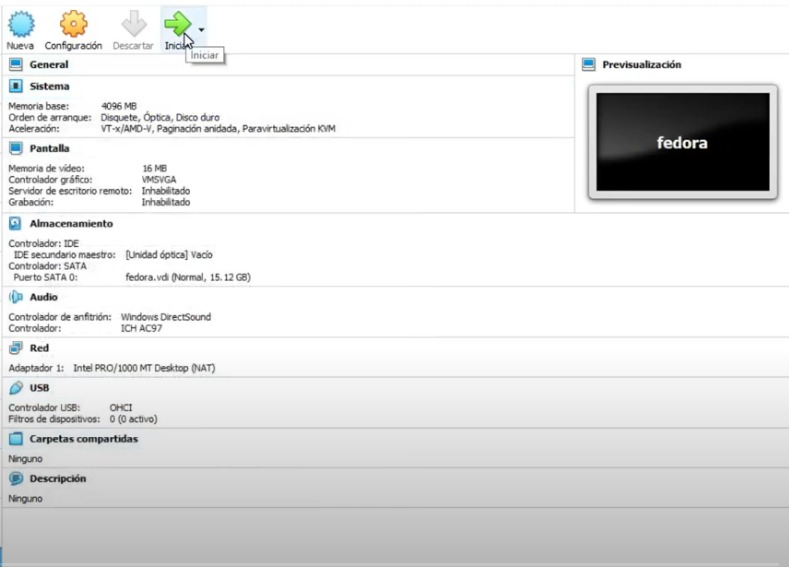

ddddd

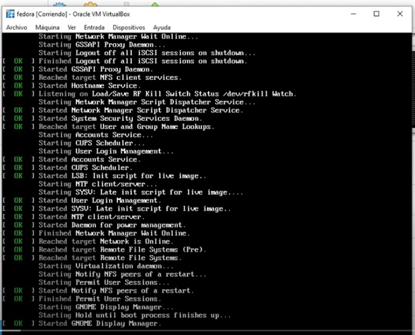

fffff

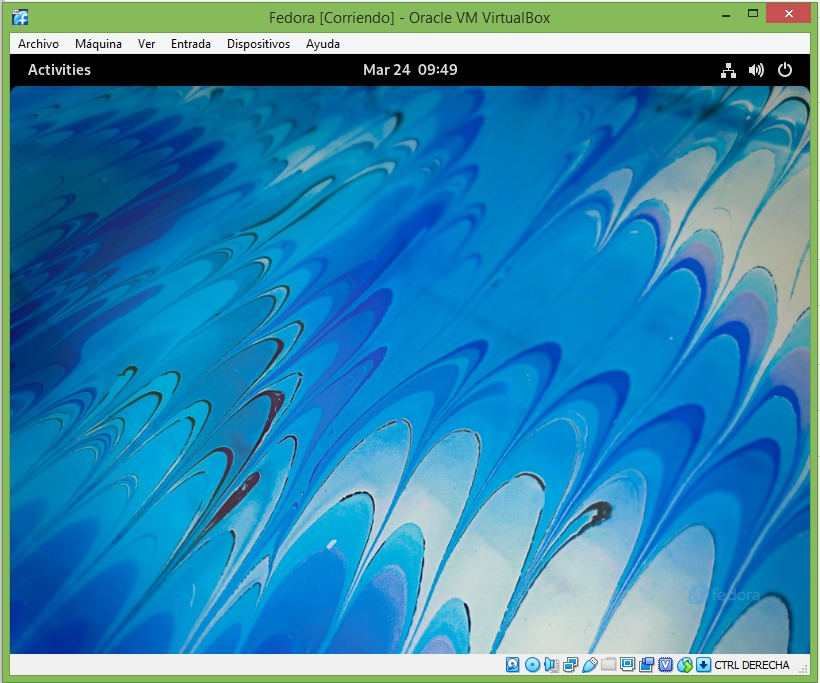

gggg

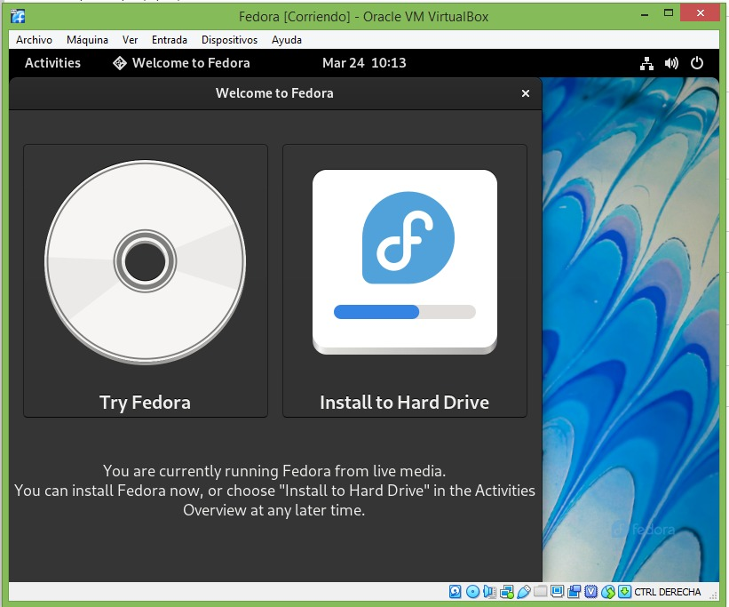

hhhhh

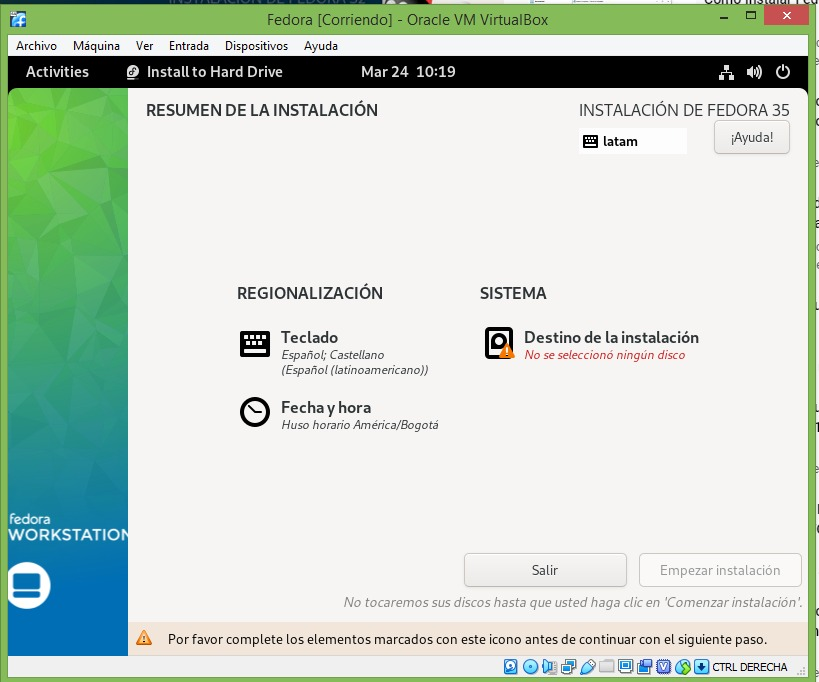

jjjj

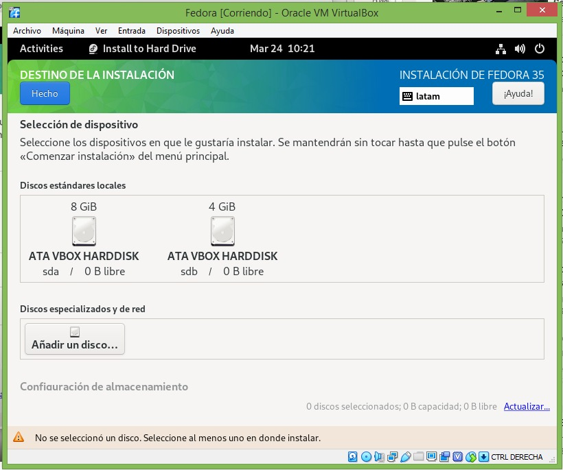

wwwww

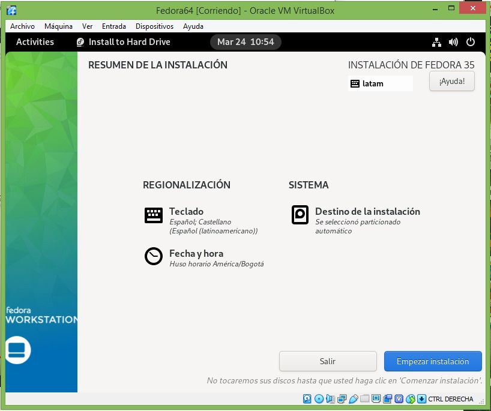

ddddddd

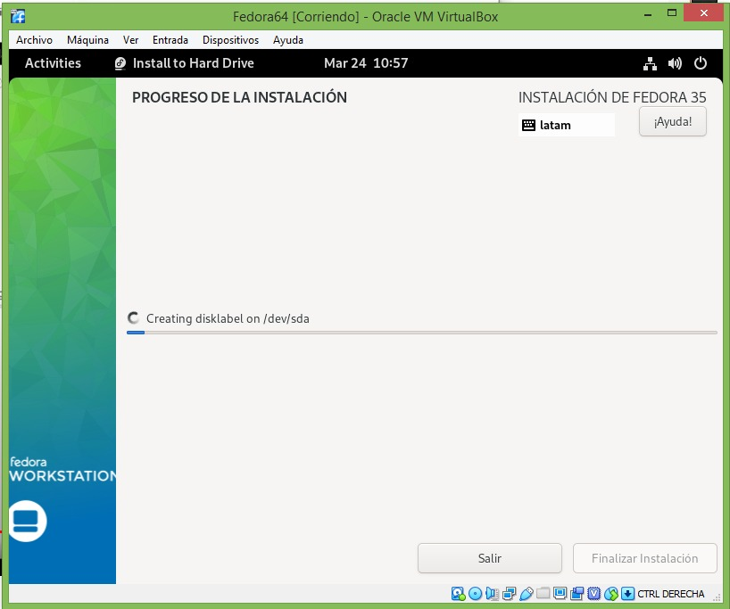

rrrr

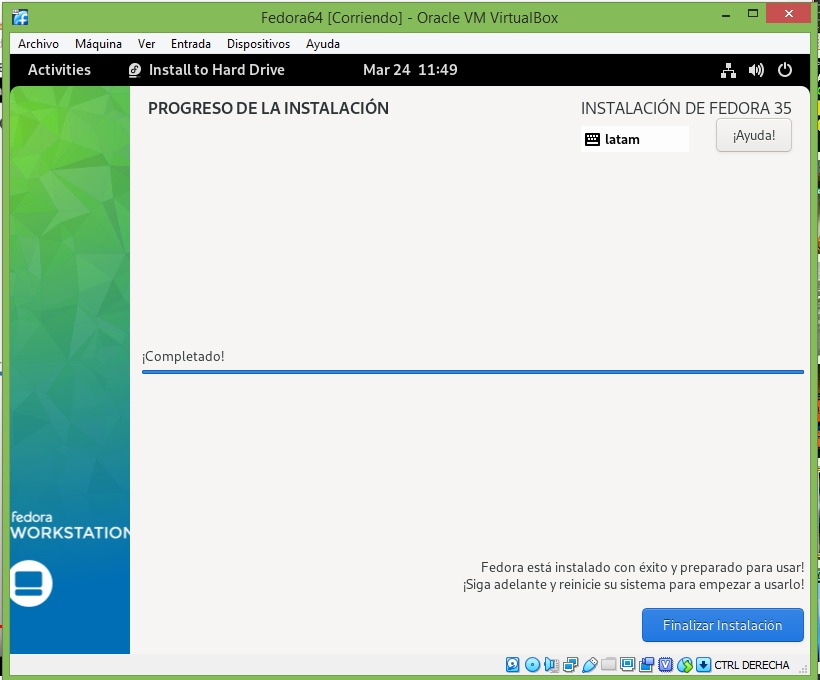

tttttt

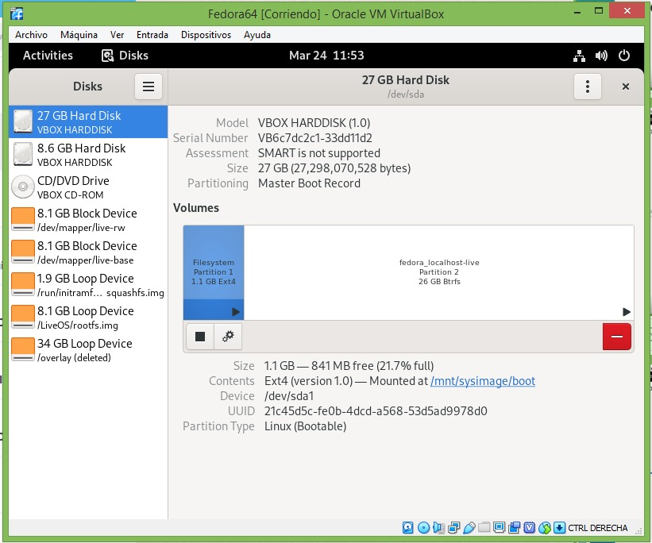

ooooooo

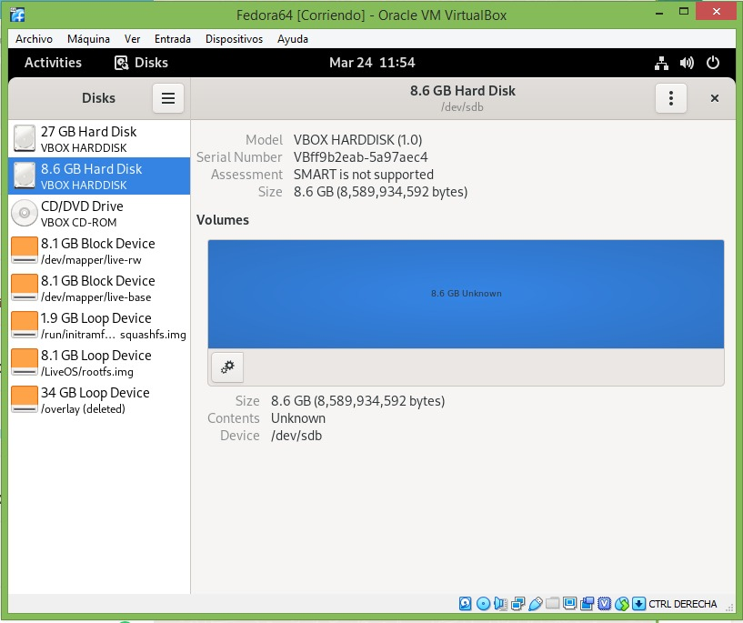

ooooooo

ddddd