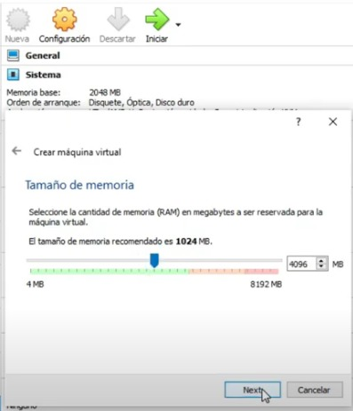
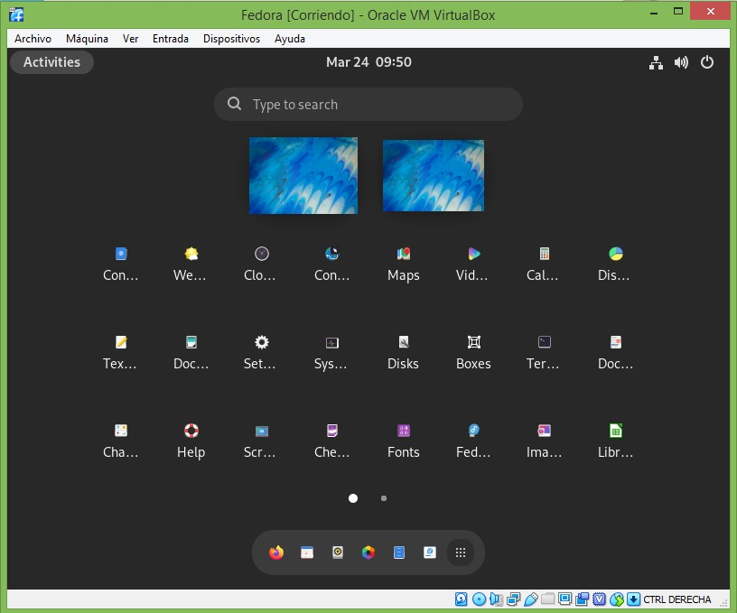

# FEDORA
INTALACION PASO A PASO DE FEDORA

## INICIO 

Desde la maquina virtualbox le damos nueva.. 
creamos nombre de nuestra maquina 
y selecionamos la version que tiene nuetro windows 
damos siguiente o next.

Le asignamos tamaño de memoria el que queramos o el recomendado por la maquina
y damos siguiente o next.

Le damos o selecionamos crear un disco duro virtual ahora.. Damos crear.

selecionamos VDI(Vritualbox Disk image) damos clic a siguente o next.

realizamos un (reservado dinamicamente), damos clic en siguiente o next.

Le asignamos tamaño de disco duro el que queramos o el recomendado por la maquina,
y damos crear y listo.

Damos clic, en el boton (inicio) de virtualbox.  

auntomaticamente arranca la insalacion de fedora, y esperamos a que termine...

Listo tenemos maquina fedora, encendida y corriendo normal mente.

Empeamos configuracion y particion de los discos selecionando o dando clic en (instalacion to hard drive).

selecionamos o damos clic en sistema (destino de la instalacion), teniendo en cuenta las letras rojas que estan abajito.

damos clic en el primer disco o de mayor tamaño hasta que aparesca selecionada por un chulito hacia arriba, y damos en Hecho.

automaticamente debe aparecer.. sin las letras de abajo en rojo si no normal, y damos clic en empesar instalacion.

automaticamente empiesa el proceso de instalacion y esperamos.

Al completar la istalacion damos clic en (finalizar instalacion).

En el ecritorio buscamos (disk) y damos clic para ver si estan correctamente las particiones.

Verificamos que esten correctas las parciones en le disco que particionamos.

Verificamos que este correcto el segundo disco y listo maquina fedora particionada correctamente.

## FINALIZAMOS EL PROCESO 

Podemos a apagar la maquina dando boton de apagado 
##                       gracias 